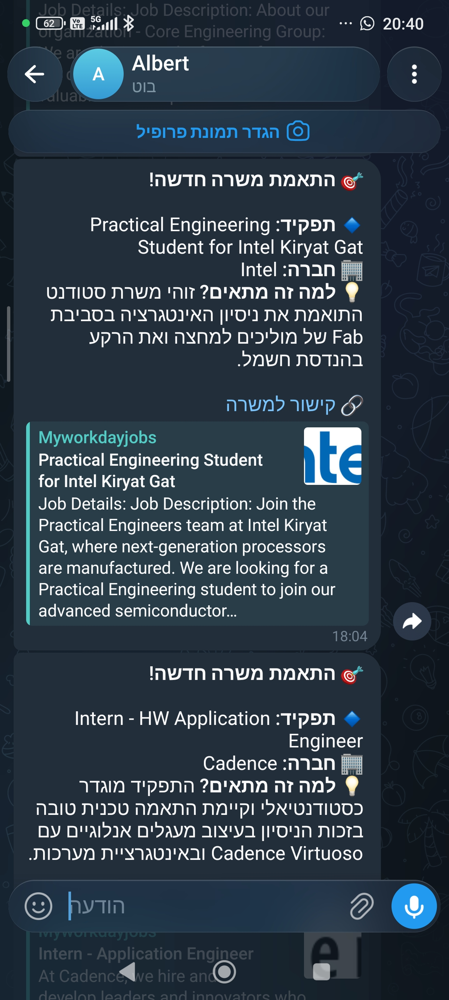
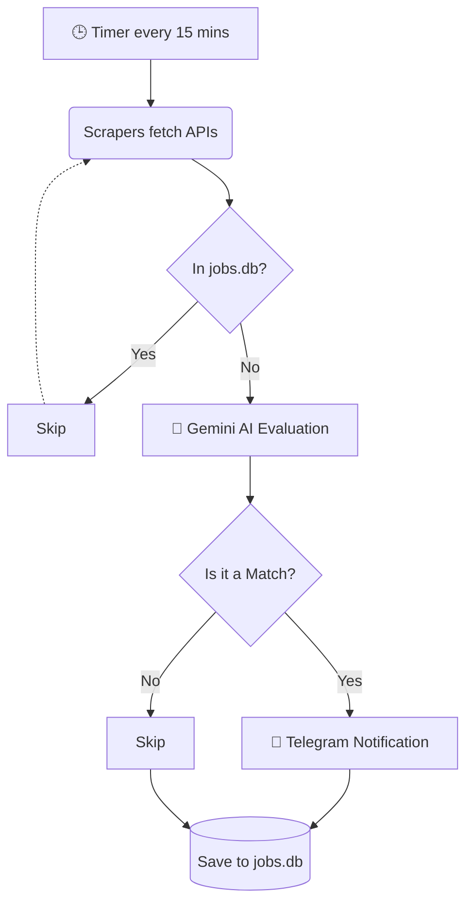

# 🤖 AI Job Scraper Bot

An intelligent, fully automated Job Scraping Bot that monitors top tech companies' career pages, evaluates jobs using LLM (Google Gemini), and sends real-time Telegram notifications for matching roles.

## 🌟 Features
* **Multi-Platform Scraping:** Built with an Object-Oriented architecture using a `BaseScraper` interface. Currently supports custom integrations for:
  * **Workday API** (Intel, Marvell, Cadence, Broadcom)
  * **Oracle Cloud HCM** (Nova, Rafael)
  * **Lever API** (Mobileye)
  * **SmartRecruiters API** (SanDisk)
  * **Custom/TalentBrew HTML** (Arm, Ceva, Amazon)
* **AI Evaluation Pipeline:** Uses Google Gemini 2.5 Flash to read job descriptions and compare them against a specific candidate's CV to determine a perfect match.
* **Smart Caching:** Implements SQLite database to cache seen jobs, preventing duplicate notifications and saving API quotas.
* **Real-time Notifications:** Sends instant alerts via Telegram Bot API with formatted markdown, job summaries, and direct application links.

## 📸 Demo (Proof of Work)
> *An automated alert generated by the system, identifying a match and pushing it directly to Telegram:*

## 🏗 Architecture
1. **`main.py`**: The central orchestrator that manages the polling loop (every 15 minutes).
2. **`scraper_base.py`**: Defines the `JobListing` dataclass and the `BaseScraper` interface.
3. **`scrapers/`**: Contains specific implementations for each ATS/Company API.
4. **`ai_evaluator.py`**: Handles the prompt engineering and API calls to Google Gemini.
5. **`db.py`**: Manages the local SQLite database (`jobs.db`).
6. **`telegram_notifier.py`**: Handles asynchronous messaging to the Telegram client.

## 🚀 How It Works

1. Scrapers hit the respective APIs and return a list of currently open positions.
2. The orchestrator checks `jobs.db`. If a job ID exists, it is skipped.
3. If new, the job description and title are sent to the Gemini AI alongside the candidate's CV.
4. If Gemini returns `Match: true`, a notification is fired to Telegram.
5. The job is marked as seen in the database.

> *Disclaimer: This project was built for educational purposes to demonstrate API integration, OOP in Python, and LLM automation.*
