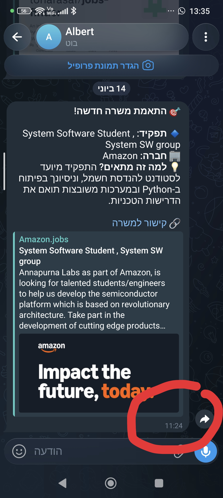
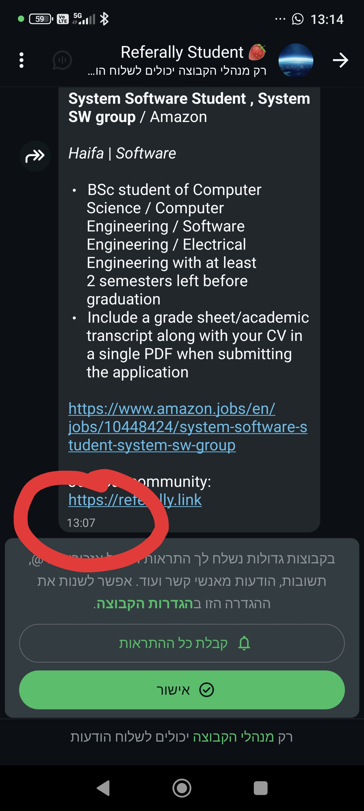
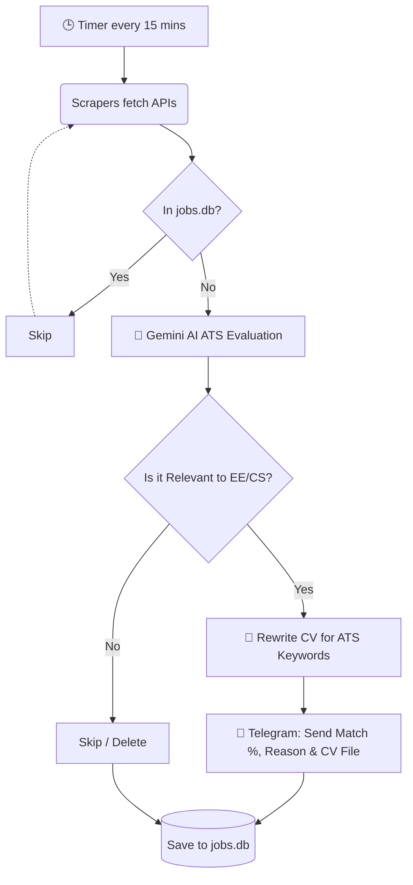

# 🤖 AI Job Scraper Bot

An intelligent, fully automated Job Scraping Bot that monitors top tech companies' career pages, evaluates jobs using LLM (Google Gemini), and sends real-time Telegram notifications for matching roles.

## 🌟 Features
* **Multi-Platform Scraping:** Built with an Object-Oriented architecture using a `BaseScraper` interface. Currently supports custom integrations for:
  * **Workday API** (Intel, Marvell, Cadence, Broadcom)
  * **Oracle Cloud HCM** (Nova, Rafael)
  * **Lever API** (Mobileye)
  * **SmartRecruiters API** (SanDisk)
  * **Custom/TalentBrew HTML** (Arm, Ceva, Amazon)
* **ATS Optimizer & CV Tailoring (New!):** Uses Google Gemini 2.5 Flash as an automated HR screener. It assigns a **Match Percentage (0-100%)**, explains missing keywords, and **dynamically rewrites** your CV to bypass ATS systems without hallucinating experience.
* **Smart Caching:** Implements SQLite database to cache seen jobs, preventing duplicate notifications and saving API quotas.
* **Real-time Notifications & Document Delivery:** Sends instant alerts via Telegram Bot API with formatted markdown, job summaries, direct application links, and automatically attaches the tailored `Tohar_Asaf_CV.txt` file ready for submission!

## 📸 Demo (Proof of Work)
> **Beating the market by almost 2 hours! 🚀**
> The images below demonstrate the true power of this bot. On the left/top, you can see our automated bot identifying and pushing the Amazon "System Software Student" job directly to Telegram at **11:24**. 
> On the right/bottom, you can see the fastest, most popular WhatsApp job group ("Referally") posting the *exact same job* at **13:07**!

**🤖 Our Bot (11:24):** 

**🟢 The Fastest WhatsApp Group (13:07):** 

## 🏗 Architecture
1. **`main.py`**: The central orchestrator that manages the polling loop (every 15 minutes).
2. **`scraper_base.py`**: Defines the `JobListing` dataclass and the `BaseScraper` interface.
3. **`scrapers/`**: Contains specific implementations for each ATS/Company API.
4. **`ai_evaluator.py`**: Handles the prompt engineering and API calls to Google Gemini, including ATS grading and CV rewriting.
5. **`db.py`**: Manages the local SQLite database (`jobs.db`).
6. **`telegram_notifier.py`**: Handles asynchronous messaging to the Telegram client, including document uploads.

## 🚀 How It Works

1. Scrapers hit the respective APIs and return a list of currently open positions.
2. The orchestrator checks `jobs.db`. If a job ID exists, it is skipped.
3. If new, the job description and title are sent to the Gemini AI alongside the candidate's CV.
4. If Gemini returns `Match: true`, a notification is fired to Telegram.
5. The job is marked as seen in the database.

> *Disclaimer: This project was built for educational purposes to demonstrate API integration, OOP in Python, and LLM automation.*
